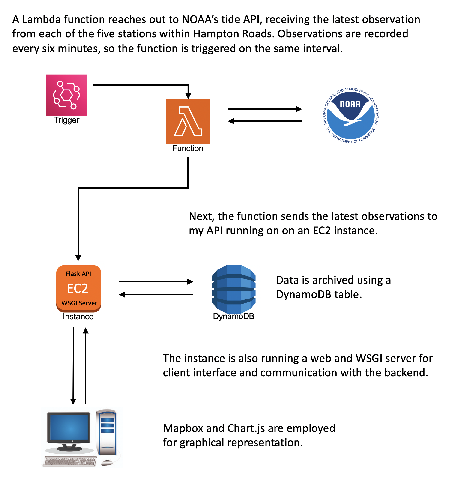

# Hampton_Roads_Tide_App
A simple web server with API to show real-time tidal data for the Hampton Roads Virginia region. 

The intent of this project is two-fold. First to build a data pipeline using AWS services. And secondly, to create an interactive web experience. 

Admittingly, this project is a lot more complicated than it needs to be. An embedded javaScriot code could just as easily interacted with NOAA's fully-functioning API, eliminating the need for AWS. But what fun would that be?

Here's how it works:

